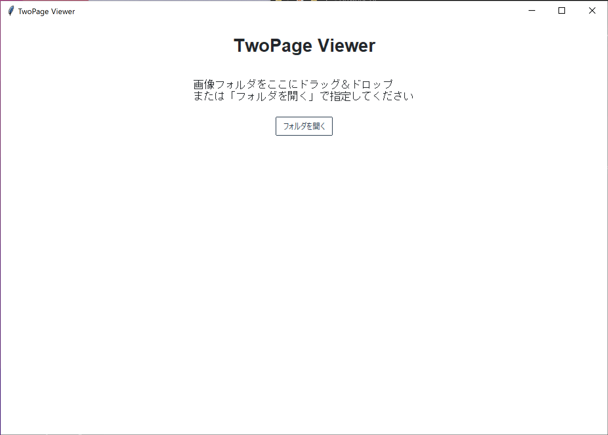

# TwoPage Viewer (画像見開き表示アプリ)


指定したフォルダ内にある画像を「見開き」形式で表示するシンプルな画像ビューアです。ドラッグ＆ドロップで画像フォルダを読み込み、左右ページを同時に表示します。右綴じ・左綴じの切り替えや、ファイル名の透かし表示、ページ送りなど、軽快に操作することが可能です。

## 特徴

- **ドラッグ＆ドロップ対応**: ウィンドウ上に画像フォルダをドロップするだけで閲覧開始
- **見開き表示**: ページを2枚同時に表示し、漫画や雑誌を読むような感覚で閲覧可能
- **右綴じ・左綴じ切り替え**: 日本の漫画（右綴じ）にも、洋書（左綴じ）にも対応
- **ファイル名表示（透かし）トグル**: 画像上部にファイル名を表示するかどうか選択可能
- **ページ送り**: マウスホイールやキーボード（左右キー）で軽快なページ送りが可能
- **プログレスバー表示**: 現在のページが全体のどの位置か、一目で把握

## 必要要件

- Python 3.7 以上
- `ttkbootstrap` (GUI テーマ)
- `Pillow` (画像処理)
- `tkinterdnd2`（ドラッグ＆ドロップ対応、未インストール時はD&D機能無しで動作可）
- 標準ライブラリ `tkinter`（Python同梱）

## インストール手順 ※Python実行する場合

### 1. Python の依存パッケージのインストール

```bash
pip install ttkbootstrap pillow tkinterdnd2
```

tkinterは通常Pythonに同梱されていますが、環境によっては別途インストールが必要な場合があります。

### 2. スクリプトの実行

```bash
python twoPageViewer.py
```

ファイル名は任意のものを利用してください。
あるいはReleaseよりEXEファイルをダウンロードして実行してください。

## 使い方



アプリケーションを起動すると、メインウィンドウが表示されます。画像フォルダをウィンドウ内へドラッグ＆ドロップ、または「フォルダを開く」ボタンから手動で選択します。

画像が見開き表示され、左右キーやマウスホイールでページをめくることができます。ナビゲーションバーから「右綴じ」ボタンで読書方向を切り替え、「ファイル名表示」で透かし表示のオンオフが可能。「最初に戻る」ボタンで先頭ページへ戻ることができます。

「戻る」ボタンでメインメニューに戻り、再度別のフォルダを選択できます。

## 注意事項

- 大量の高解像度画像を扱うと、描画時に処理が重くなる場合があります。
- tkinterdnd2がインストールされていない環境では、ドラッグ＆ドロップが利用できません。その場合、フォルダ選択ダイアログで対応してください。

## トラブルシューティング

### 画像が表示されない

- 有効な画像ファイル（JPEG, PNG, GIF, BMP等）がフォルダ内に存在するか確認してください。

### ドラッグ＆ドロップできない

- tkinterdnd2が正しくインストールされているか確認。また、一部環境ではD&Dが制限されることがあります。

## ライセンス

このツールは MIT License の下で公開します。
ただし、利用しているライブラリ (ttkbootstrap, Pillow, tkinterdnd2) はそれぞれ独自のライセンスに従います。

## 作者

このツールは個人ブログ [UhiyamaLab](https://uhiyama-lab.com/) の記事用に作成されました。
