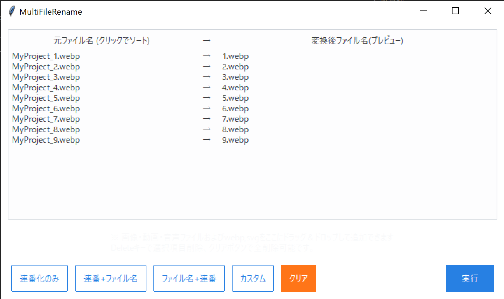

# MultiFileRename (ファイル一括リネーム)



`MultiFileRename`は、画像・動画・音声ファイル（webpやsvgを含む）を一括でリネームするためのツールです。ドラッグ＆ドロップ対応で、指定したルール（連番のみ、元ファイル名+連番、独自テンプレートなど）に従ってファイル名を変換し、一括で変更を行います。

## 特徴

- **ドラッグ＆ドロップ対応**: 対象のファイルをウィンドウへ直接ドロップ可能  
- **カスタムテンプレート機能**: `{filename}`, `{num}`, `{date}` などのプレースホルダで柔軟なファイル名生成  
- **複数モード**:  
  - 連番のみ（`1.jpg`, `2.jpg`, ...）  
  - 連番+ファイル名（`1_original.jpg`）  
  - ファイル名+連番（`original_1.jpg`）  
  - カスタムテンプレート  
- **重複チェック・存在チェック**: リネーム前に同名ファイルや既存ファイルを検出してエラー表示  
- **ソート機能**: 元ファイル名やプレビュー名でソート可能  
- **直感的なGUI**: `ttkbootstrap` で整えた見やすいUI

## 対応形式

- 画像ファイル: `jpg`, `jpeg`, `png`, `gif`, `bmp`, `tga`, `tif`, `tiff`, `psd`, `webp`, `svg`
- 動画ファイル: `mp4`, `mov`, `avi`, `mkv`, `webm`, `wmv`, `flv`, `f4v`, `m4v`
- 音声ファイル: `ogg`, `mp3`, `wav`

※非対応形式をリネームしたい場合は、コード内の`self.supported_exts`セットに拡張子を追加してください。

## 必要要件

- Python 3.7 以上
- `ttkbootstrap` (GUIテーマ)
- `tkinterdnd2` (ドラッグ＆ドロップ対応)
- 標準ライブラリ `tkinter`

## インストール手順

### 1. Python の依存パッケージのインストール

```bash
pip install ttkbootstrap tkinterdnd2
```

### 2. スクリプト実行

```bash
python MultiFileRename.py
```

ファイル名はリポジトリ内のファイルに合わせてください。

## 使い方

1. アプリを起動します。
2. 対象となるファイル（画像、動画、音声など対応拡張子）をウィンドウ内にドラッグ＆ドロップします。
3. リストが更新され、プレビュー（変換後ファイル名）が表示されます。
4. リネームモードを選択（「連番化のみ」「連番+ファイル名」「ファイル名+連番」「カスタム」）します。  
   カスタムを選択すると、下部にテンプレート設定用のオプションフレームが表示され、`{filename}`, `{num}`, `{date}`などのプレースホルダで自由な命名規則を設定可能です。
5. プレビューを確認し、問題がなければ「実行」ボタンを押します。
6. リネーム処理が実行され、選択したファイルが一括で新しい名前に変更されます。
7. 処理終了後、メッセージが表示されます。

## 注意事項

- 同名ファイルが生成される場合や、すでに存在するファイル名がある場合はエラーが表示され、リネームは中断されます。
- 一度リネームすると元に戻す機能はありませんのでご注意ください。
- 万が一のため、事前にファイルのバックアップを推奨します。

## 免責事項

本ツールの使用によるいかなる損害やデータ消失、トラブルについて、作者は一切の責任を負いません。自己責任でご利用ください。

## ライセンス

このツールは MIT License の下で公開します。  
利用しているライブラリ (ttkbootstrap, tkinterdnd2) はそれぞれ独自のライセンスに従います。

## 作者

このツールは個人ブログ [UhiyamaLab](https://uhiyama-lab.com/) の記事用に作成されました。  
